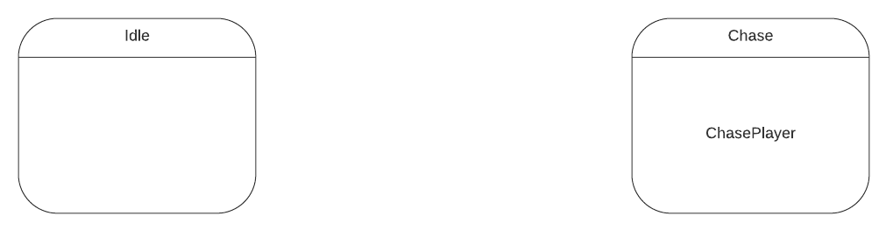
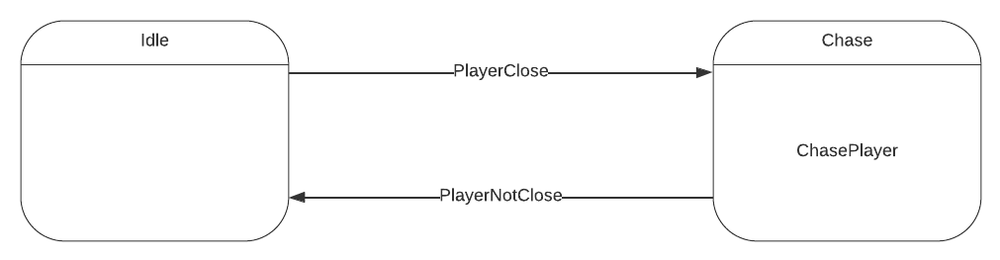

Step 1 : Deciding states
	I want to make a very simple enemy. If the player is not close it will idle, otherwise it will run towards the player.
	So There are 2 states, Idle and Chase.
	
Step 2 : Deciding transitions
	If player is close go to chase state, if player is not close go to idle state.
	
Step 3 : Create FSM class

Step 4 : Create State classes

Step 5 : Adding EnemyFSM to Enemy Game Object
