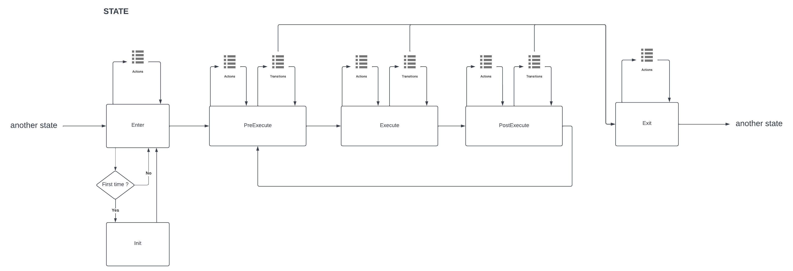
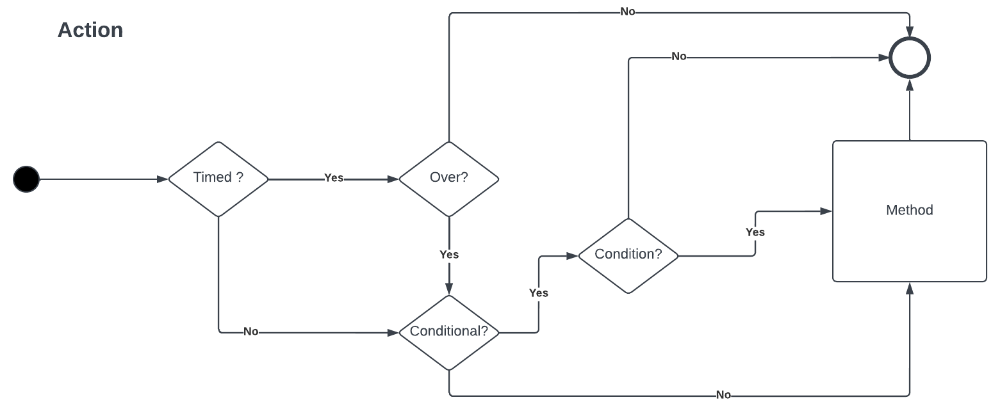
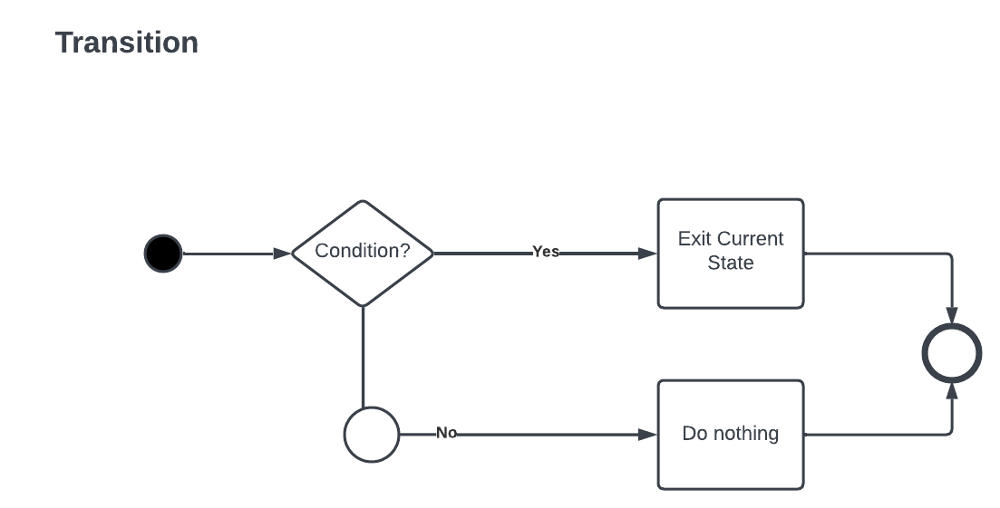

# Finite_State-Machine
 My Finite State Machine Template For Unity
 

 
 It's a finite state machine template for Unity, I tried to create a simple structure as much as possible,
  
  [Example 1](https://github.com/ozantekce/Finite-State-Machine/tree/main/Assets/Example1)
  
  
  
  
  